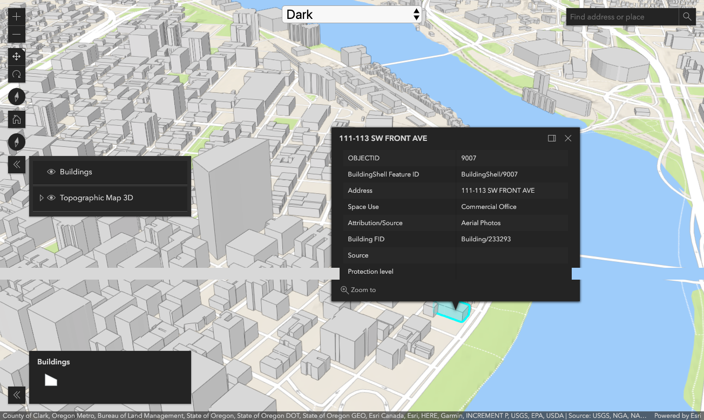
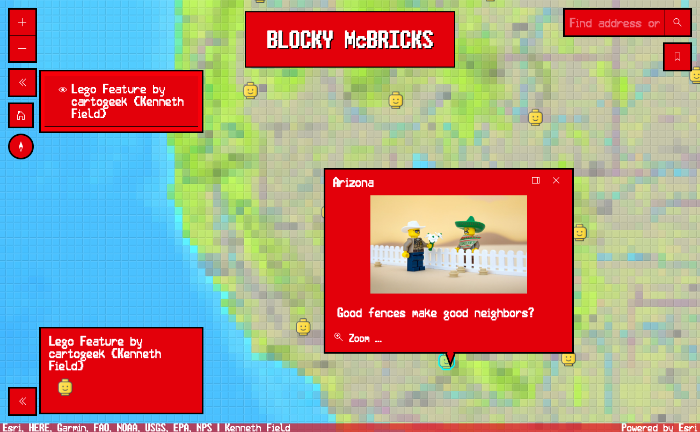
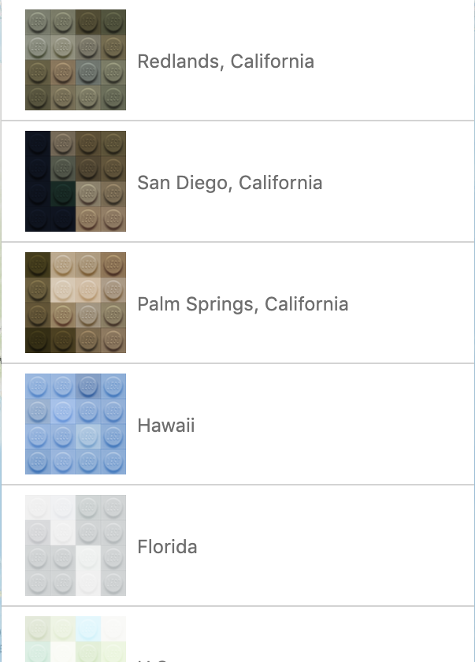

<!-- .slide: data-background="../node_modules/esri-reveal.js-templates/img/2019/uc/bg-1.png" data-background-size="cover" -->
<!-- Presenter: Franco -->

# ArcGIS API for JavaScript

## Customizing Widgets

- Matt Driscoll – [@driskull](https://twitter.com/driskull)
- JC Franco – [@arfncode](https://twitter.com/arfncode)

---

## Agenda

- What can be customized
- Customization approaches
- Demos
- Q & A

---

## Widget Composition

- Theme<span>: Styles</span><!-- .element: class="fragment" data-fragment-index="1" -->
- View<span>: Structure/Functionality</span><!-- .element: class="fragment" data-fragment-index="1" -->

---

## Customization Approaches

- Customizing a theme <!-- .element: class="fragment" data-fragment-index="1" -->
  - Custom styles (colors, sizing, font...)
  - Minor layout adjustments
- Customizing a widget view <!-- .element: class="fragment" data-fragment-index="2" -->
  - Custom UI
  - Custom functionality

---

<!-- .slide: data-background="img/bricks/blocky.png" data-background-size="cover"  -->


---

<!-- .slide: data-background="../node_modules/esri-reveal.js-templates/img/2019/uc/bg-3.png" data-background-size="cover" -->

<!-- Presenter: Matt -->

## Part I: Theming


---

## Why Theme?

- Match branding
- Match the map
- Contrast with the map
- User-specific requirements (e.g. bigger buttons)

<!-- .element: class="fragment" data-fragment-index="1" -->

---

## Esri Themes

**10** themes are provided out-of-the-box:

Using a theme requires only a slight update to the CSS path.

```html
<link href="//js.arcgis.com/4.12/esri/themes/<theme-name>/main.css" />
```

---

<!-- .slide: data-background="../node_modules/esri-reveal.js-templates/img/2019/uc/bg-4.png" data-background-size="cover" -->

## Demo: Theme Switcher

<a href="../demos/out-of-the-box-themes/" target="_blank"></a>

<a href="../demos/out-of-the-box-themes/" target="_blank" class="external">Out-of-the-box themes</a>

---

## Customizing API styling

- API CSS is using <a href="http://getbem.com/" target="_blank" class="external">BEM</a> methodology for class names.
  - `.my-widget__menu--open`
- Can override CSS selectors / use higher specificity
  - <a href="https://developers.arcgis.com/javascript/latest/sample-code/sandbox/index.html?sample=styling-simple-theme" target="_blank" class="external">Sample</a>
  - Can be tedious/brittle

---

## Theming Technology

---

We use

<a href="https://sass-lang.com/" target="_blank"></a>

### to create our CSS.

<a href="https://nodejs.org/" target="_blank"></a><!-- .element: class="fragment" data-fragment-index="1" -->
<a href="https://gruntjs.com/" target="_blank"></a><!-- .element: class="fragment" data-fragment-index="1" -->

<small><a href="https://sass-lang.com/" target="_blank" class="external">sass-lang.com</a> | <a href="https://nodejs.org/" target="_blank" class="external">nodejs.org</a> | <a href="https://gruntjs.com/" target="_blank" class="external">gruntjs.com</a></small><!-- .element: class="fragment plain" data-fragment-index="1" -->

---


### is a powerful scripting language for compiling CSS.

- Modular
- DRY
- Makes theming easy

<!-- .element: class="fragment" data-fragment-index="1" -->

---

## Theming Steps

1. Get theme utility
1. Use the utility
1. Customize your theme
1. Host your CSS file

<!-- .element: class="fragment" data-fragment-index="1" -->

---

## Theming Setup

1. Clone the <a href="https://github.com/jcfranco/jsapi-styles" class="external" target="_blank">theme utility</a> `jsapi-styles.git`
1. Run `npm install`
1. Edit <span style="font-weight:bold;">`sass/my-theme/main.scss`</span>
1. See <span style="font-weight:bold;">`dist/my-theme/main.css`</span>

<!-- .element: class="fragment" data-fragment-index="1" -->

---

## Step 1

Clone the theme utility repo

<a href="https://github.com/jcfranco/jsapi-styles" target="_blank" class="external">github.com/jcfranco/jsapi-styles</a>

<!-- .element: class="fragment" data-fragment-index="1" -->

```bash
git clone https://github.com/jcfranco/jsapi-styles.git
```

<!-- .element: class="fragment" data-fragment-index="1" -->

---

## Step 2

`npm install`

- Installs the necessary bits
- Creates a sample theme directory
- Compiles the CSS from the SCSS
- Spins up a preview in your default browser

<!-- .element: class="fragment" data-fragment-index="1" -->

---

## Step 3

#### Edit your theme

`sass/my-theme/main.scss`

#### Optionally, edit your app <!-- .element: class="fragment" data-fragment-index="1" -->

`preview/index.html` <!-- .element: class="fragment" data-fragment-index="1" -->

---

## Step 4

Host your stylesheet and any relevant assets

Link your stylesheet in your app

<!-- .element: class="fragment" data-fragment-index="1" -->

```html
<!-- In your app: -->
<link href="path/to/your/theme/main.css" />
```

<!-- .element: class="fragment" data-fragment-index="1" -->

---

## Theming Goals

### Theme Smart

<!-- .element: class="fragment" data-fragment-index="1" -->

- Avoid adding additional CSS selectors
- Instead, use Sass to your advantage

<!-- .element: class="fragment" data-fragment-index="1" -->

---

## Theme Structure

Let's look at how the core theme is structured

- Color<span>: `color.scss`</span><!-- .element: class="fragment" data-fragment-index="1" -->
- Size<span>: `sizes.scss`</span><!-- .element: class="fragment" data-fragment-index="1" -->
- Type<span>: `type.scss`</span><!-- .element: class="fragment" data-fragment-index="1" -->

---

## Theme Structure

### Default

```scss
// Inside base/_color_.scss
$background-color: #fff !default;
```

Any value assignment overrides the `!default` value.

```scss
// Inside sass/my-theme/main.scss
$background-color: #e3000b;
```

But wait...there's more!<!-- .element: class="fragment" data-fragment-index="1" -->

---

## Theme Structure

Override the core color variables...

```scss
$font-color: #fff;
$interactive-font-color: #fff;
$background-color: #e3000b;
$button-color: #fff;
```

...then magic!<!-- .element: class="fragment" data-fragment-index="1" -->

<!-- .element: class="fragment plain" data-fragment-index="1" -->

---

## Magic\*

Using `$button-color` we can set a default hover color.

```scss
$button-color--hover: darken($button-color, 10%) !default;
// ...etc
```

---

## Theming Documentation

- <a href="https://developers.arcgis.com/javascript/latest/guide/styling/index.html#sassy-widgets" target="_blank" class="external">API Styling Guide</a>
- <a href="https://github.com/jcfranco/jsapi-styles/blob/master/README.md" target="_blank" class="external">Style Utility Readme</a>

---

## Lets make a theme

Brand colors

<!-- .element: class="fragment" data-fragment-index="1" -->


<!-- .element: class="fragment" data-fragment-index="1" -->

---

## Custom Theme

Blocky McBricks: Fine miniature plastic bricks



---

<!-- .slide: data-background="../node_modules/esri-reveal.js-templates/img/2019/uc/bg-4.png" data-background-size="cover"  -->

## Demo: Custom Theme

- <a href="../../jsapi-styles/preview/" target="_blank" class="external">Preview Start</a>
- <a href="../demos/custom-theme/" target="_blank" class="external">Custom Theme App</a>
- <a href="../demos/custom-theme/STEPS.md" target="_blank" class="external">Demo Steps</a>

---

## Theming Recap

- Use Sass & the theme utility to your advantage
- Theme structure
  - Color
  - Size
  - Typography
- Use the core variables and override their values

---

<!-- .slide: data-background="../node_modules/esri-reveal.js-templates/img/2019/uc/bg-3.png" data-background-size="cover" -->

## Part II: Customizing widget views

---

## Widget = View + ViewModel

Presentation is separate from business logic <!-- .element: class="fragment" data-fragment-index="1" -->

- Reusable <!-- .element: class="fragment" data-fragment-index="1" -->
- UI replacement <!-- .element: class="fragment" data-fragment-index="1" -->
- Framework integration <!-- .element: class="fragment" data-fragment-index="1" -->

<!-- .element: class="fragment" data-fragment-index="1" -->

---

## Views

- Presentation of the Widget
- Uses ViewModel APIs to render the UI
- View-specific logic resides here
- Extends `esri/widgets/Widget`

<!-- .element: class="fragment" data-fragment-index="1" -->

---

## Widget (Base) Class

`esri/widgets/Widget`

- Provides lifecycle
- API consistency

<!-- .element: class="fragment" data-fragment-index="1" -->

---

## Widget Lifecycle

- `constructor()`
- `postInitialize()`
- `render()`
- `destroy()`

<!-- .element: class="fragment" data-fragment-index="1" -->

---

## `render()`

- Defines UI
- JSX
- Reacts to renderable properties (private or public)
- Virtual DOM

<!-- .element: class="fragment" data-fragment-index="1" -->

---

## Working with Views

API Exploration

- [Bookmarks Doc](https://developers.arcgis.com/javascript/latest/api-reference/esri-widgets-Bookmarks.html)
- [Bookmarks Sample](https://developers.arcgis.com/javascript/latest/sample-code/widgets-bookmarks/index.html)

---

## Customizing a widget view

Brickified™ Bookmarks widget


&nbsp;&nbsp;&nbsp;&nbsp;&nbsp;&nbsp;&nbsp;&nbsp;&nbsp;


---

<!-- .slide: data-background="../node_modules/esri-reveal.js-templates/img/2019/uc/bg-4.png" data-background-size="cover" -->

## Demo: Customizing a widget view

- [Demo Start](../demos/custom-widget-views/)
- [Demo Steps](https://github.com/jcfranco/uc-2019-customizing-widgets/tree/master/demos/custom-widget-views)

---

## Customizing a widget view recap

- Widget = View + ViewModel <!-- .element: class="fragment" data-fragment-index="1" -->
  - Reusable <!-- .element: class="fragment" data-fragment-index="1" -->
  - UI replacement <!-- .element: class="fragment" data-fragment-index="1" -->
  - Framework integration <!-- .element: class="fragment" data-fragment-index="1" -->
- Extended existing widget <!-- .element: class="fragment" data-fragment-index="3" -->
  - Lifecycle <!-- .element: class="fragment" data-fragment-index="3" -->
  - Custom rendering <!-- .element: class="fragment" data-fragment-index="3" -->

---

# Conclusion

- Themed by changing colors, sizing, etc.
- Altered presentation (custom UI)

---

## Recommended Sessions

- [ArcGIS API for JavaScript: The Road Ahead](https://userconference2019.schedule.esri.com/schedule/1105824428)
- [Building Web Apps with the ArcGIS API for JavaScript](https://userconference2019.schedule.esri.com/schedule/1991692024)

---

## Additional Resources

- [Implementing Accessor](https://developers.arcgis.com/javascript/latest/guide/implementing-accessor/index.html)
- [Setting up TypeScript](https://developers.arcgis.com/javascript/latest/guide/typescript-setup/index.html)
- [Widget Development](https://developers.arcgis.com/javascript/latest/guide/custom-widget/index.html)
- [JS API SDK](https://developers.arcgis.com/javascript/)

---

<!-- .slide: data-background="../node_modules/esri-reveal.js-templates/img/2019/uc/bg-5.png" data-background-size="cover" -->

---

## Questions?

##### For example

🤔 Where can I find the slides/source?

👉 [esriurl.com/customwidgetsuc2019](http://esriurl.com/customwidgetsuc2019) 👈

---

<!-- .slide: data-background="../node_modules/esri-reveal.js-templates/img/2019/uc/bg-4.png" data-background-size="cover" -->

## Thank You!

> Ideas for next User Conference related to web development 💡
>
> `jsapi_pm@esri.com`
